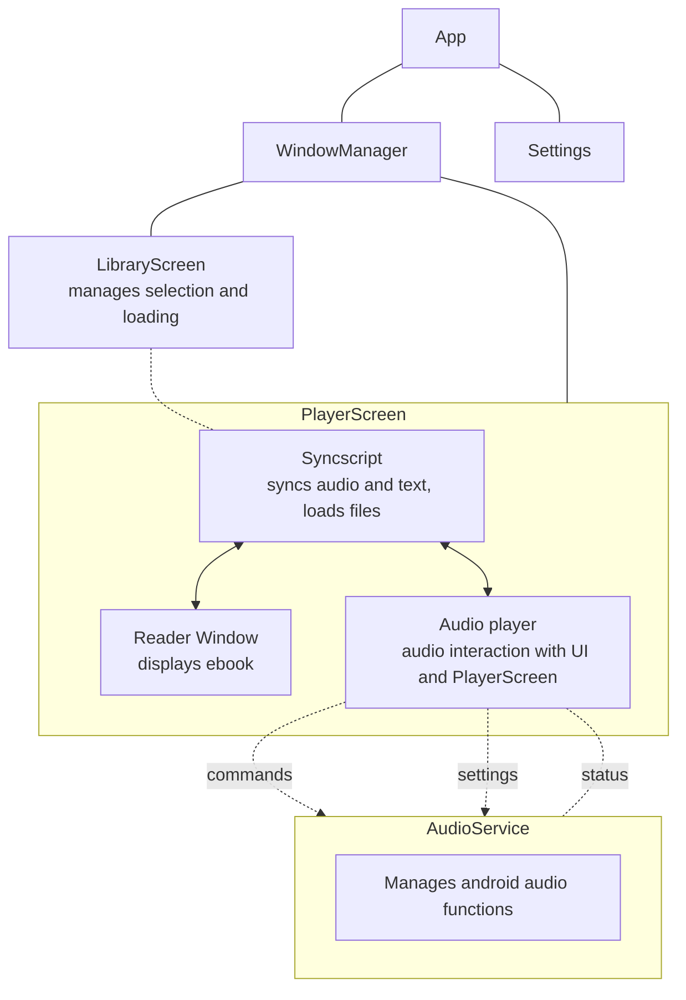

## Note
This project is no longer under active development, partly because of issues with Kivy-android integration that would be difficult to solve without a rewrite in Java/Kotlin, and partly because 
of the excellent [Storyteller](https://gitlab.com/smoores/storyteller) app which achieves the same goal, and I now use regularly on my device instead of Minerva.
I have made the repo public as a demonstration of how to make a (reasonably) complex app using Kivy.

## Description

Minerva is an integrated ebook reader and audiobook player app for android writen in python using the [Kivy](https://kivy.org/) framework. Minerva uses transcription and fuzzy string matching to produce a dictionary
of sync data which can allow for automatically syncing the audio to the text when turning the page or moving to the correct page when seeking to a new audio position. I developed this because I like to listen to
audiobooks when walking/cooking etc, but find it takes too long to get through a 40 hour audiobook without being able to speed up the process by reading.

Minerva uses some python-Java interoperability using the jnius library to correctly play audio within an android service (so that audio can play in the background when the app is closed) and communicates with the
service using [oscpy](https://github.com/kivy/oscpy) to send commands and receive status information from the audio player.

## Architecture Diagram

A diagram showing the Kivy app tree with the main components of Minerva and their functions.

